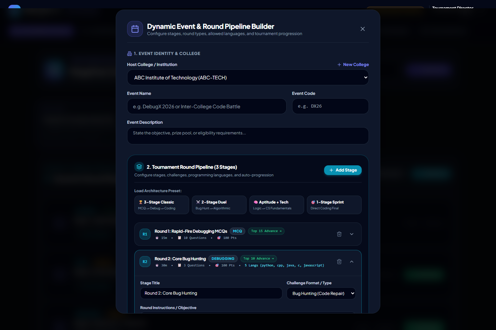
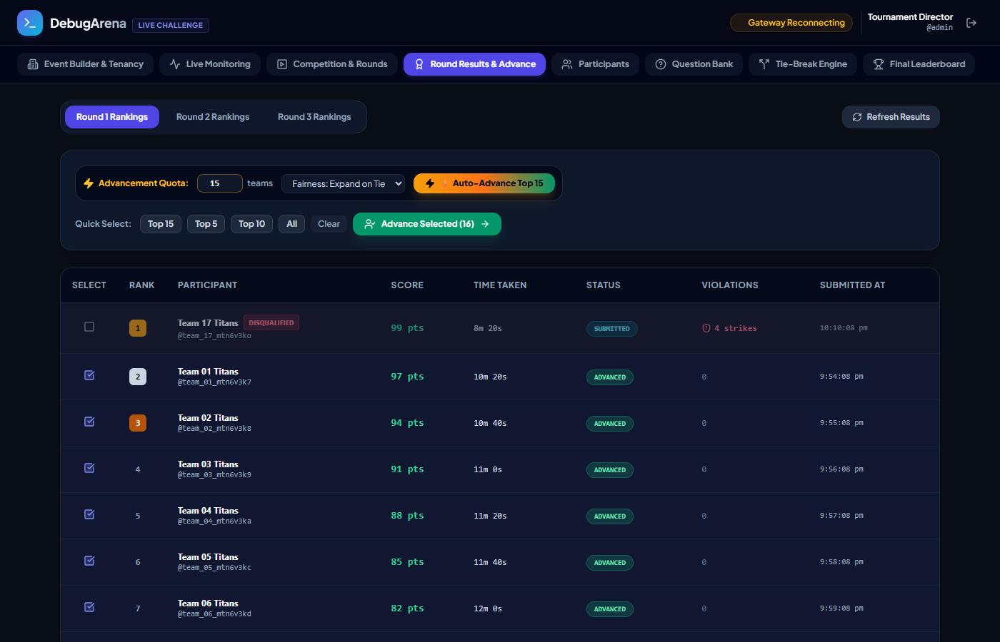
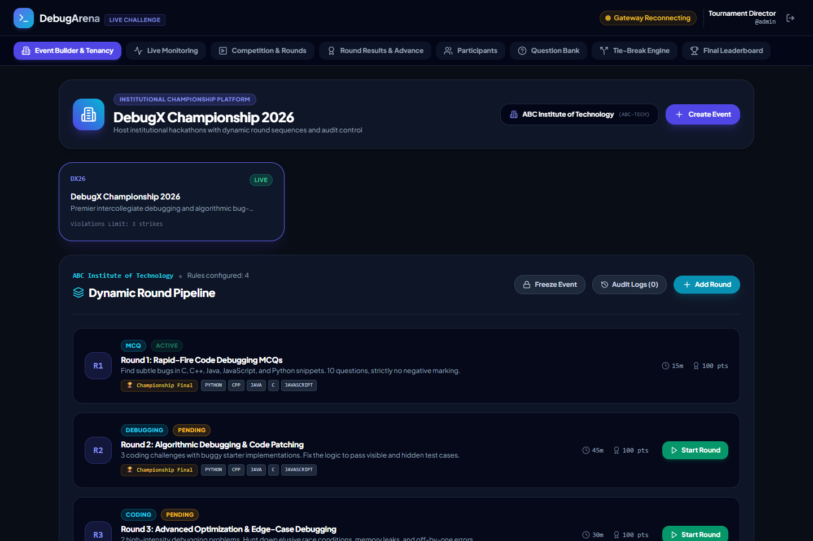
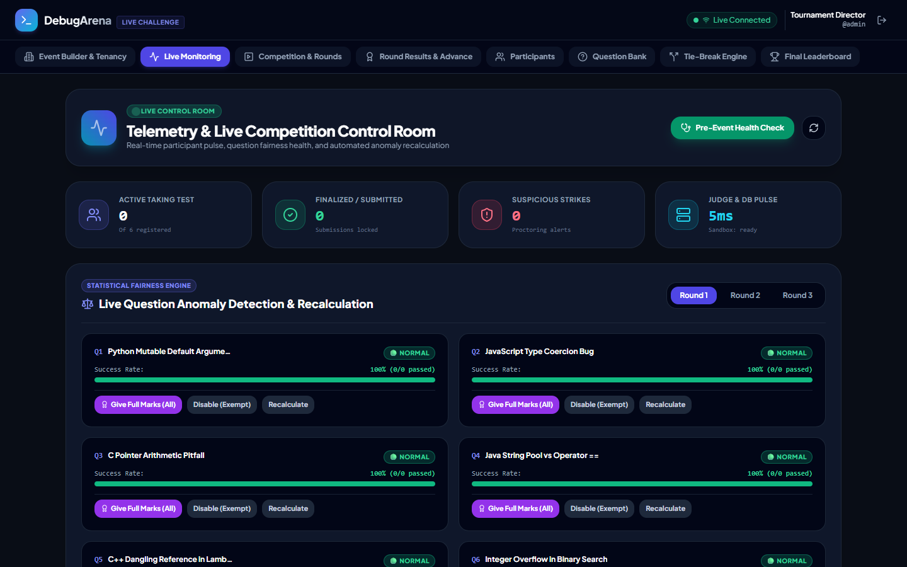
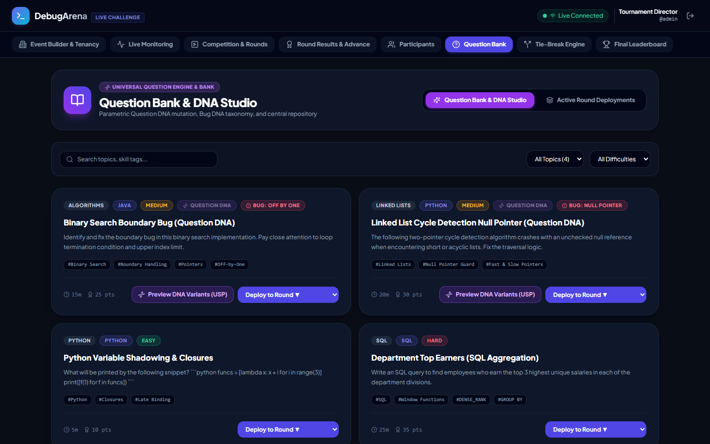
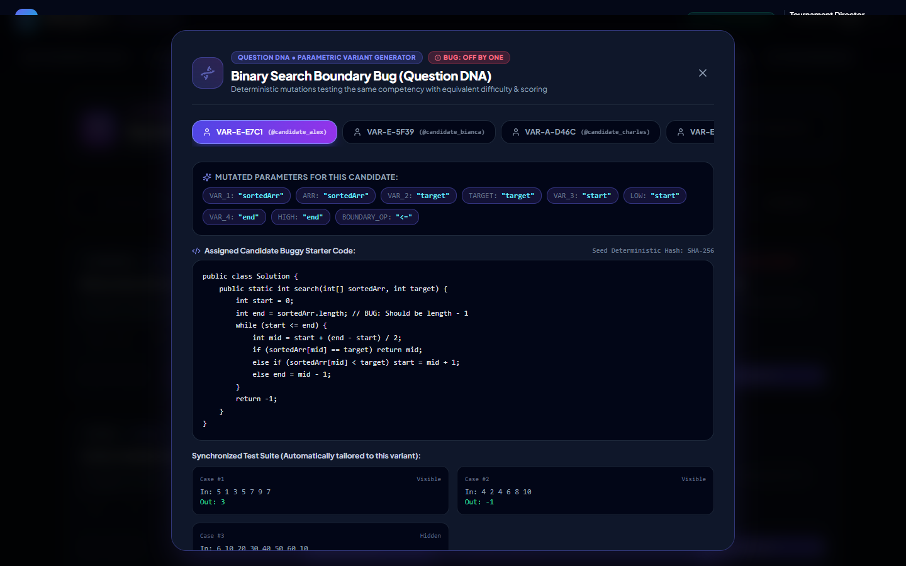
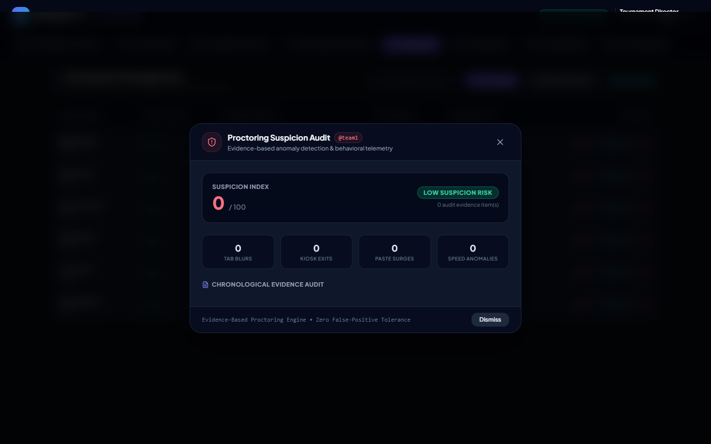
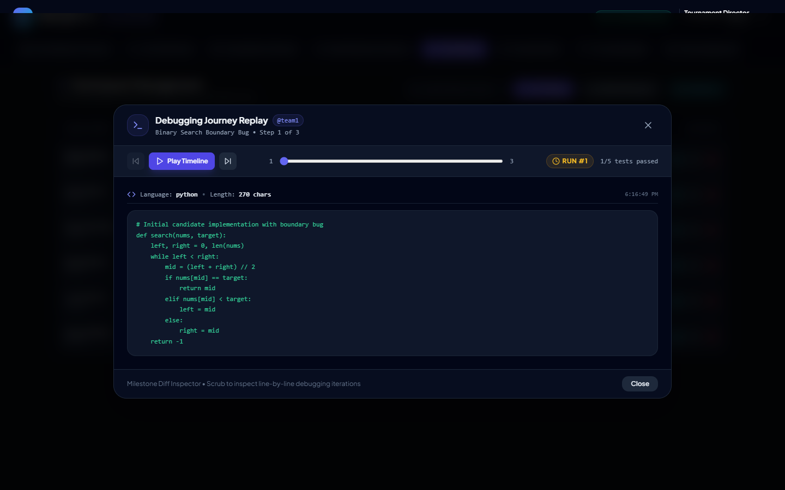
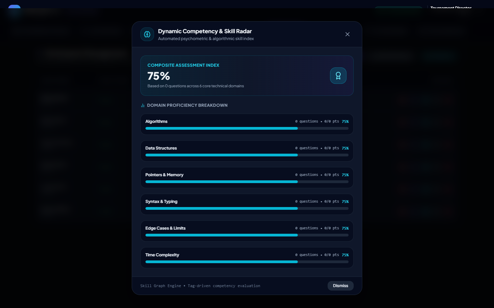
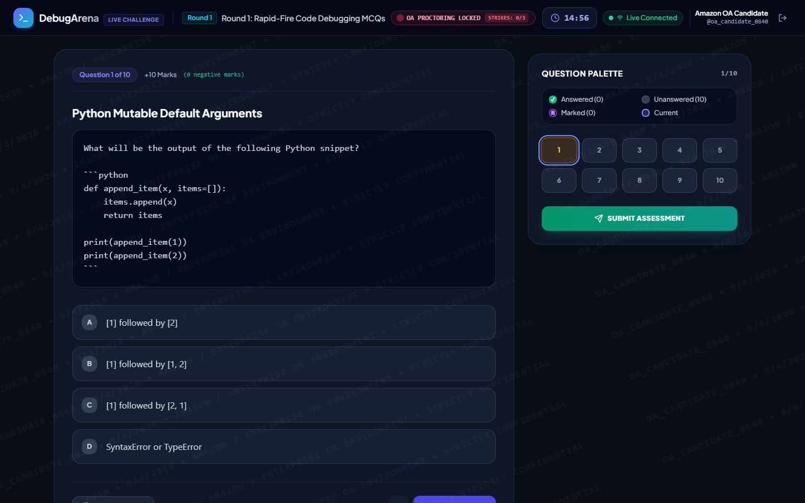

# DebugArena — Enterprise Multi-College Coding & Debugging Tournament Platform

DebugArena is an enterprise-grade, multi-tenant competition and assessment platform engineered for universities, hackathons, and national coding tournaments. It features a unified monorepo housing both the **Participant Proctored Assessment Portal** and the **Host College Command Center**.

---

## 🌟 Visual Showcase & Key Innovations

### 1. Dynamic Event Pipeline Designer & Automated Round Quotas
Before launching an event, college administrators customize every stage of the tournament:
- **Modular Round Types**: MCQ Debugging rounds, Algorithmic Coding rounds, and Sudden-Death Tiebreakers.
- **Language & Runtime Selection**: Per-round configuration for Python, JavaScript, C, C++, and Java with custom time limits and penalty rules.
- **Automated Advancement Quotas**: Set exact qualification thresholds upfront (e.g., *Round 1: 25 teams → Round 2: Top 15 → Final: Top 10*). The system handles ranking, cutoffs, and locked access automatically.
- **Modular Round Types**: MCQ Debugging rounds, Algorithmic Coding rounds, and Sudden-Death Tiebreakers.
- **Language & Runtime Selection**: Per-round configuration for Python, JavaScript, C, C++, and Java with custom time limits and penalty rules.
- **Automated Advancement Quotas**: Set exact qualification thresholds upfront (e.g., *Round 1: 25 teams → Round 2: Top 15 → Final: Top 10*). The system handles ranking, cutoffs, and locked access automatically.

<p align="center">
  
</p>

<p align="center">
  
</p>

---

### 3. Strict Multi-Tenant Privacy & Competitor Concealment
Host colleges enjoy completely private, tenant-isolated experiences:
- **Zero Cross-College Visibility**: Colleges never see other institutions' events, question banks, participants, or leaderboards.
- **Scoped API & Database Security**: All event builders, participant queries, and mutations strictly enforce the authenticated administrator's `collegeId`. Competitor resources return HTTP 404 (zero existence disclosure).

<p align="center">
  
</p>

---

### 4. Live Control Room, Fairness Engine & Pre-Event Health Inspector
- **Centralized Control**: Real-time Socket.io gateway broadcasting participant logins, code executions, test pass rates, and security breaches.
- **Question Anomaly & Fairness Detection**: Automatically flags questions where pass rates diverge significantly from historical difficulty norms.
- **System Readiness Inspector**: One-click verification of database latency, sandbox availability, and round schedules prior to kickoff.

<p align="center">
  
</p>

---

### 5. Universal Question Engine, Question DNA & Bug Mutation Studio
- **Question Bank Studio**: Create, tag, and categorize MCQ and code debugging challenges with sample and hidden test cases.
- **Question DNA & Bug Mutation**: Automatically generates diverse syntactic and logical bug variants to prevent candidate collusion.

<p align="center">
  
</p>

<p align="center">
  
</p>

---

### 6. Evidence-Based Suspicion Engine, Journey Replay & Skill Radar
- **Suspicion Engine**: Flags anomalous submission timing, massive sudden code pastes, and repeated compilation failures with visual evidence cards.
- **Debugging Journey Replay**: Chronological step-by-step playback of how each candidate edited their code and iterated toward their solution.
- **Dynamic Skill Radar**: Evaluates candidate competencies across Algorithmic Logic, Syntax Mastery, Optimization, and Debugging Speed.

<p align="center">
  
</p>

<p align="center">
  
</p>

<p align="center">
  
</p>

---

### 7. Proctored Assessment Environment & Server-Authoritative Timing
- **Mandatory Fullscreen & Proctoring Shield**: Enforces locked fullscreen. Tab switching and focus loss trigger strikes; exceeding the threshold results in automatic submission.
- **Server-Authoritative Clock**: Eliminates client-side clock tampering. Round expiration and auto-submits are synchronized strictly via server timestamps.
- **Offline Sync Resilience**: Real-time debounced progress persistence (~1.5s). In the event of network interruptions, answers are safely buffered locally and synced automatically upon reconnection.

<p align="center">
  
</p>

---

### 7. Custom Testcase Stdin Playground & Extended Bulk Ingestion
- **LeetCode-Style Arbitrary Stdin Playground**: In the coding assessment shell, participants can toggle between official test cases and an interactive **"Custom Testcase"** terminal tab. Candidates can provide arbitrary standard input (`stdin`) to test algorithms with edge cases, inspecting standard output (`stdout`), compilation/runtime error stacks, and execution time (ms) in real-time without affecting leaderboard scoring.
- **Native File Upload & Extended Bulk CSV Ingestion**: Organizers can drag-and-drop or browse `.csv` roster files directly with automated UTF-8 BOM (`\uFEFF`) sanitization, header auto-detection, and extended schema support (`username, team_name, password, department, year, regNo`), rendering student identifiers directly onto participant tables.

---

## 🛠️ Tech Stack & Architecture

| Layer | Technologies |
| :--- | :--- |
| **Frontend** | React 19, TypeScript, Vite, Tailwind CSS, Lucide Icons, Canvas/SVG Rendering |
| **Backend** | Node.js, Express, TypeScript, Socket.io, JSON Web Tokens (JWT), Crypto (HMAC-SHA256) |
| **Database** | MongoDB with Mongoose (with automated `mongodb-memory-server` fallback for zero-config local runs) |
| **Execution Sandbox** | Multi-language code execution engine (Python native, Judge0 / Piston integration for C, C++, Java) |
| **Integrity & Security** | Server-authoritative timer, full-screen lock proctoring, rate-limiting, multi-tenant isolation |

---

## 🚀 Quick Start Guide

### 1. Prerequisites
- **Node.js** (v18 or later)
- **npm** (v9 or later)
- **Python 3** (`python` or `py`) installed on system PATH for native Python challenge evaluation.

### 2. Installation
Clone the repository and install all root, client, and server dependencies:
```bash
git clone https://github.com/Suriya528/DebugArena.git
cd DebugArena
npm run install:all
```

### 3. Launch Development Environment
Start both the backend server and frontend development client concurrently:

```bash
# Terminal 1: Backend Server (runs on http://localhost:5000)
npm run server

# Terminal 2: Frontend Client (runs on http://localhost:5173)
npm run client
```

*Note: On first launch, the server automatically initializes an in-memory MongoDB instance and seeds sample colleges, events, questions, and participant accounts.*

---

## 🔑 Default Seeded Accounts

| Role | Username | Password | Purpose & Scope |
| :--- | :--- | :--- | :--- |
| **Host College Admin** | `admin` | `admin123` | College Alpha Command Center (Events, Control Room, Standings) |
| **Participant 1** | `team1` | `debug123` | Demo Team 1 (Binary Beasts) |
| **Participant 2** | `team2` | `debug123` | Demo Team 2 (Null Pointers) |
| **Participant 3** | `team3` | `debug123` | Demo Team 3 (Stack Overflows) |
| **Participant 4** | `team4` | `debug123` | Demo Team 4 (Byte Benders) |
| **Participant 5** | `team5` | `debug123` | Demo Team 5 (Logic Bombs) |
| **Participant 6** | `team6` | `debug123` | Demo Team 6 (Syntax Strikers) |

---

## 🧪 Automated Verification & Test Suites

The project includes an end-to-end automated testing suite covering all architectural layers:

```bash
# Production Database, Seeding Guards & Rate Limiting Verification
npx --prefix server tsx src/scripts/verify_production_hardening.ts

# Zero-Flaw Architectural Hardening & Multi-Subsystem Integrity (34/34 tests)
npx --prefix server tsx src/scripts/verify_architectural_hardening.ts

# High-Impact Features Verification (Custom Stdin, Bulk CSV)
npx --prefix server tsx src/scripts/verify_new_features.ts

# Multi-Tenant Privacy & Isolation (15/15 tests)
npx --prefix server tsx src/scripts/verify_tenant_privacy.ts

# Full Assessment & Scoring Lifecycle Verification
npx --prefix server tsx src/scripts/verify_all.ts

# Sudden-Death Tiebreaker Engine Verification
npx --prefix server tsx src/scripts/verify_tiebreak.ts

# Automated Headless Chrome Browser Verification
npx --prefix server tsx src/scripts/browser_verify.ts
```

---

## 📁 Repository Structure

```
DebugArena/
├── docs/
│   └── screenshots/           # High-resolution architectural screenshots
├── client/                    # Vite + React 19 + TypeScript + Tailwind CSS
│   ├── src/
│   │   ├── components/
│   │   │   ├── admin/         # ControlRoom, EventBuilder, Leaderboard, etc.
│   │   │   └── participant/   # ProctoredShell, CodingShell, McqShell, TieBreakShell, etc.
│   │   ├── context/           # AuthContext, SocketContext
│   │   ├── hooks/             # useFullscreen, useTimer, useOfflineQueue
│   │   └── services/          # api.ts (with offline queue), socket.ts
│   └── vite.config.ts
├── server/                    # Express + TypeScript + Mongoose + Socket.io
│   ├── src/
│   │   ├── config/            # db.ts (MemoryServer fallback), env.ts
│   │   ├── models/            # College, Event, Round, Question, Attempt, etc.
│   │   ├── middleware/        # auth.ts (tenant isolation, role guards, proctoring checks)
│   │   ├── routes/            # admin.ts, participant.ts, auth.ts
│   │   ├── services/          # judgeService.ts, scoringService.ts, timerService.ts
│   │   └── scripts/           # seed.ts, test scripts, screenshot capture utilities
│   └── tsconfig.json
└── package.json               # Root scripts (install:all, server, client)
```

---

## 📜 License & Accreditation
Built for high-stakes university tournaments, competitive programming events, and hackathons. Licensed under the MIT License.
